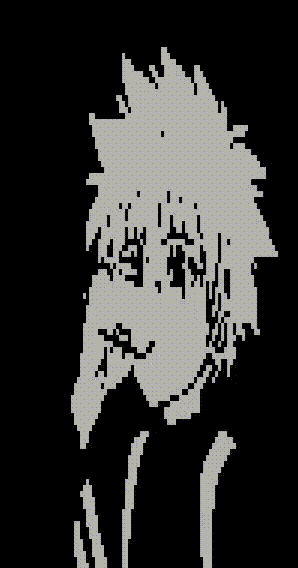
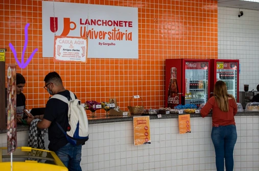

I'm Diego Reis, a Computer Science student in Brazil currenlty working as Open Source contributor at [Turso](https://turso.tech).

I'm very interested in ~almost~ any topic involving computing, I love helping other people,
running in the late afternoon and trying new things. Currently my main interests are:

- Databases
- Programming Languages
- Systems Programming

## Fun Facts

1. I already worked as a waiter in bars, restaurants, clubs and in my university's cafeteria.

2. I was theme of a famous brazilian news. Basically I make a raffle of my grandfather's books
to make some money to go to a book event called bienal. Here is the [article](https://g1.globo.com/sp/vale-do-paraiba-regiao/noticia/2016/09/estudante-rifa-livros-escritos-pelo-avo-para-ir-bienal-do-livro-em-sao-paulo.html)

3. I'm a BIG [paçoca](https://en.wikipedia.org/wiki/Pa%C3%A7oca) enjoyer.

4. Yawd stands for **Y**et **A**nother **W**eb **D**ev, but I've not been doing too much web development. I'll find a better acronym for it.

You can reach me out on:

- [X (twitter)](https://x.com/el_yawd)
- [Github](https://github.com/el-yawd)
- [Linkedin](https://www.linkedin.com/in/the-diego-reis)
